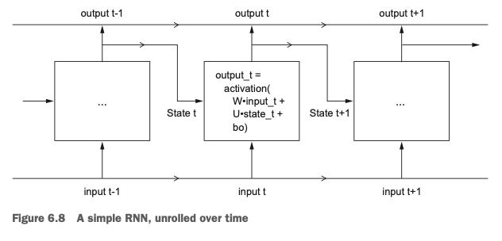
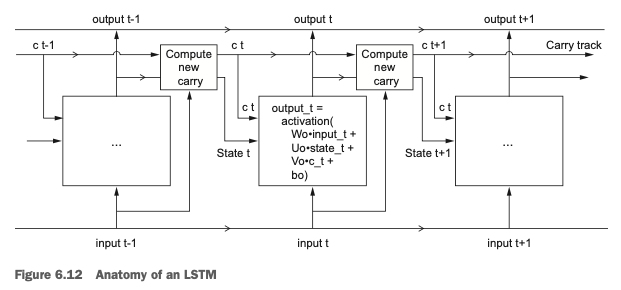

## 1. Working with text data

Vectorizing text is the process of transforming text into numeric tensors. 


* Segment text into words, and transform each word into a vector.

* Segment text into characters, and transform each character into a vector.

* Extract n-grams of words or characters, and transform each n-gram into a vector. N-grams are overlapping groups of multiple consecutive words or characters. Word n-grams are groups of N (or fewer) consecutive words that you can extract from a sentence. E.g. "The cat sat on the mat." $\rightarrow$ `{"The", "The cat", "cat", "cat sat", "sat",
  "sat on", "on", "on the", "the", "the mat", "mat"}` using a set of 2-grams.

All text-vectorization processes consist of applying some tokenization scheme and then associating numeric vectors with the generated tokens (words, characters, or n-grams). 

### 1. One-hot encoding of words and characters

It consists of associating a unique integer index with every word and then turning this integer index i into a binary vector of size N (the size of the vocabulary); the vector is all zeros except for the i th entry, which is 1.

__Word Level One Hot Encoding__
```{r,eval=FALSE}
samples = c("The cat sat on the mat.", "The dog ate my homework.")

token_index = list() 
for (sample in samples){
  for (word in strsplit(sample, " ")[[1]])
    if (!word %in% names(token_index)){
      token_index[[word]] <- length(token_index) + 2
    }
}

max_length = 10
results = array(0, dim = c(length(samples), max_length,
                            max(as.integer(token_index))))

for (i in 1:length(samples)){
  sample = samples[[i]]
  words = head(strsplit(sample, " ")[[1]], n = max_length) 
  for (j in 1:length(words)){
    index = token_index[[words[[j]]]]
    results[[i, j, index]] = 1 
    }
}
```

__Character Level One Hot Encoding__
```{r, eval=FALSE}
samples = c("The cat sat on the mat.", "The dog ate my homework.")
ascii_tokens = c("", sapply(as.raw(c(32:126)), rawToChar)) 
token_index = c(1:(length(ascii_tokens))) 
names(token_index) = ascii_tokens
max_length = 50
results = array(0, dim = c(length(samples), max_length, length(token_index)))
for (i in 1:length(samples)){
  sample = samples[[i]]
  characters = strsplit(sample, "")[[1]] 
  for (j in 1:length(characters)) {
    character = characters[[j]]
    results[i, j, token_index[[character]]] = 1 }
}
```

__Keras Implementation__
```{r,eval=FALSE}
library(keras)
samples = c("The cat sat on the mat.", "The dog ate my homework.")
tokenizer = text_tokenizer(num_words = 1000) %>%
  fit_text_tokenizer(samples)
sequences = texts_to_sequences(tokenizer, samples)
one_hot_results = texts_to_matrix(tokenizer, samples, mode = "binary") 
word_index = tokenizer$word_index
```

A variant of one-hot encoding is the so-called one-hot hashing trick, which you can use when the number of unique tokens in your vocabulary is too large to handle explicitly. Instead of explicitly assigning an index to each word and keeping a reference of these indices in a dictionary, you can hash words into vectors of fixed size. This is typically done with a very lightweight hashing function. The main advantage of this method is that it does away with maintaining an explicit word index, which saves memory and allows online encoding of the data (you can generate token vectors right away, before you’ve seen all of the available data). The one drawback of this approach is that it’s susceptible to hash collisions : two different words may end up with the same hash, and subsequently any machine-learning model looking at these hashes won’t be able to tell the difference between these words. The likelihood of hash collisions decreases when the dimensionality of the hashing space is much larger than the total number of unique tokens being hashed.

```{r, eval=FALSE}
library(hashFunction)
samples = c("The cat sat on the mat.", "The dog ate my homework.")
dimensionality = 1000

max_length = 10
results = array(0,0, dim = c(length(samples), max_length, dimensionality))

for(i in 1:length(samples)){
  sample = samples[[i]]
  words = head(strsplit(sample, " ")[[1]], n = max_length)
  for(j in 1:length(words)){
    index = abs(spooky.32(words[[i]])) %% dimensionality
    results[[i,j,index]] = 1
  }
}
```

### 2. Word embeddings

Whereas the vectors obtained through one-hot encoding are binary, sparse (mostly made of zeros), and very high-dimensional (same dimensionality as the number of words in the vocabulary), word embeddings are low- dimensional floating-point vectors (that is, dense vectors, as opposed to sparse vectors).It's common to see word embeddings that are 256-dimensional, 512-dimensional, or 1,024-dimensional, when dealing with very large vocabularies.

* Learn word embeddings jointly with the main task you care about (such as document classification or sentiment prediction). In this setup, you start with random word vectors and then learn word vectors in the same way you learn the weights of a neural network.

* Load into your model word embeddings that were precomputed using a different machine-learning task than the one you’re trying to solve. These are called pretrained word embeddings.


Word index $\rightarrow$ Embedding layer $\rightarrow$ Corresponding word vector
`embedding_layer <- layer_embedding(input_dim = 1000, output_dim = 64)`

Example: Word Embedding for IMDB movie review. 

1. Prepare the data and restrict the move reviews to the top 10,000 most common words, and cut off the reviews after only 20 words. 

```{r, eval=FALSE}
max_features = 10000
maxlen = 20

imdb = dataset_imdb(num_words = max_features)
c(c(x_train, y_train), c(x_test, y_test)) %<-% imdb
x_train <- pad_sequences(x_train, maxlen = maxlen)
x_test <- pad_sequences(x_test, maxlen = maxlen)
```

2. Using an embedding layer and classifier
```{r, eval=FALSE}
model = keras_model_sequential() %>%
      layer_embedding(input_dim = 10000, output_dim = 8,
                      input_length = maxlen) %>%
      layer_flatten() %>%
      layer_dense(units = 1, activation = "sigmoid")
model %>% compile(
      optimizer = "rmsprop",
      loss = "binary_crossentropy",
      metrics = c("acc")
)
summary(model)
history = model %>% fit( x_train, y_train, epochs = 10,
batch_size = 32, validation_split = 0.2
)
```


__Using a Pretrained word embeddings__

e.g. word2vec, GloVe.

### 3. From raw text to word emebeddings

An IMDB example. 

* Step 1. Processing the labels
```{r, eval=FALSE}
imdb_dir = "~/OneDrive - Pfizer/Learning/Deep Learning with R/aclImdb/"
train_dir =  file.path(imdb_dir, "train")
labels = c() 
texts = c()
for (label_type in c("neg", "pos")) {
  label = switch(label_type, neg = 0, pos = 1)
  dir_name = file.path(train_dir, label_type)
  for (fname in list.files(dir_name, pattern = glob2rx("*.txt"),
                           full.names = TRUE)) {
    texts = c(texts, readChar(fname, file.info(fname)$size))
    labels = c(labels, label) }
}
```

* Step 2. Tokenize the text of the raw data
```{r, eval=FALSE}
library(keras)

maxlen = 100 ## Cut off review after 100 words
training_samples = 200
validation_samples = 10000
max_words = 10000 ## consider only top 10,000 words in the datasets

tokenizer = text_tokenizer(num_words = max_words) %>% fit_text_tokenizer(texts) 
sequences = texts_to_sequences(tokenizer, texts)

word_index = tokenizer$word_index
data = pad_sequences(sequences, maxlen = maxlen)
labels = as.array(labels)

indices = sample(1:nrow(data))
training_indices = indices[1:training_samples] 
validation_indices = indices[(training_samples + 1):(training_samples + validation_samples)]
x_train = data[training_indices,] 
y_train = labels[training_indices]
x_val = data[validation_indices,] 
y_val = labels[validation_indices]
```

* Step 3. Prepare the GloVe word embedding file (https://nlp.stanford.edu/projects/glove)
```{r, eval=FALSE}
glove_dir = "~/Downloads/glove.6B"
lines = readLines(file.path(glove_dir, "glove.6B.100d.txt"))
embeddings_index = new.env(hash = TRUE, parent = emptyenv()) 
for(i in 1:length(lines)){
  line = lines[[i]]
  values = strsplit(line, " ")[[1]]
  word = values[[1]]
  embeddings_index[[word]] = as.double(values[-1])
}

embedding_dim = 100
embedding_matrix = array(0, c(max_words, embedding_dim))
for (word in names(word_index)){ 
  index = word_index[[word]]
  if (index < max_words) {
    embedding_vector = embeddings_index[[word]] 
    if (!is.null(embedding_vector))
        embedding_matrix[index+1,] <- embedding_vectors
  }
}
```

* Step 4. Define the model
```{r, eval=FALSE}
model <- keras_model_sequential() %>%
layer_embedding(input_dim = max_words, output_dim = embedding_dim,
                  input_length = maxlen) %>%
  layer_flatten() %>%
  layer_dense(units = 32, activation = "relu") %>%
  layer_dense(units = 1, activation = "sigmoid")
summary(model)
```

Step 5. Loading the pretrianed word embedding into the embedding layer
```{r, eval=FALSE}
get_layer(model, index = 1) %>%
  set_weights(list(embedding_matrix)) %>%
  freeze_weights()
```

Step 6. Train and evaluation
```{r, eval=FALSE}
model %>% compile(
  optimizer = "rmsprop",
  loss = "binary_crossentropy",
  metrics = c("acc")
)
history <- model %>% fit(
x_train, y_train,
epochs = 20,
batch_size = 32,
validation_data = list(x_val, y_val)
)
save_model_weights_hdf5(model, "pre_trained_glove_model.h5")
```

## 2. Recurrent Neural Network

RNN processes sequences by iterating through the sequence elements and maintaining a state containing information relative to what it has seen so far. In effect, an RNN is a type of neural network that has an internal loop. You still consider one sequence a single data point: a single input to the network. What changes is that this data point is no longer processed in a single step; rather, the network internally loops over sequence elements.

Conceptual psedudocode RNN
```{r, eval=FALSE}
state_t = 0
for(input_t in input_sequence){
  output_t = activation(dot(W, input_t) + dot(U, state_t) + b)
  state_t = output_t    ## The previous output becomes the state for the next iteration
}
```

RNN is a for loop that reuses quantities computed during the previous iteration of the loop. `output_t = tanh(as.numeric((W %*% input_t) + (U %*% state_t) + b))`

```{r,echo=FALSE,out.width="200%",out.height="200%",fig.align = "center"}

```

### 2.1 Recurrent layer in Keras

`layer_simple_rnn` takes input of shape `(batch_size, timesteps, input_features)`. It has two potential outcomes

* 1. Return the whole sequence
```{r, eval=FALSE}
model = keras_model_sequential() %>%
  layer_embedding(input_dim = 10000, output_dim = 32) %>%
  layer_simple_rnn(units = 32, return_sequences = TRUE)
```

* 2. Return the last timestep
```{r, eval=FALSE}
model = keras_model_sequential() %>% 
  layer_embedding(input_dim = 10000, output_dim = 32) %>% 
  layer_simple_rnn(units = 32)
```

Stack several recurrent layers can increase the power. 

```{r,eval=FALSE}
model = keras_model_sequential() %>%
  layer_embedding(input_dim = 10000, output_dim = 32) %>%
  layer_simple_rnn(units = 32, return_sequences = TRUE) %>%
  layer_simple_rnn(units = 32, return_sequences = TRUE) %>%
  layer_simple_rnn(units = 32, return_sequences = TRUE) %>%
  layer_simple_rnn(units = 32)
```

### 2.2 LSTM and GRU

One major issue with `layer_simple_rnn` is that although it should theoretically be able to retain at time t information about inputs seen many timesteps before, in practice, such long-term dependencies are impossible to learn. This is due to the vanishing gradient problem, an effect that is similar to what is observed with non-recurrent networks (feedforward networks) that are many layers deep: as you keep adding layers to a network, the net- work eventually becomes untrainable.

__LSTM__: It saves information for later, thus preventing older signals from gradually vanishing during processing. 

LSTM adds on top of a simple RNN a number `Ct` at each timestep, which stands for carry. It will be combined with the input connection and the recurrent connection. It will affect the state being sent to the next timestep

```{r,echo=FALSE,out.width="200%",out.height="200%",fig.align = "center"}

```

Pseudocode of LSTM architecture
```{r, eval=FALSE}
output_t = activation(dot(state_t, Uo) + dot(input_t, Wo) + dot(C_t, Vo) + bo)
i_t = activation(dot(state_t, Ui) + dot(input_t, Wi) + bi) 
f_t = activation(dot(state_t, Uf) + dot(input_t, Wf) + bf) 
k_t = activation(dot(state_t, Uk) + dot(input_t, Wk) + bk)

c_t+1 = i_t * k_t + c_t * f_t
```

`c_t*f_t`: forget irrelevant information in the carry dataflow

`i_t*k_t`: provide information about the present updating teh carry track with new information


More info about RNN [link](RNN/RNN.html).

Example:
```{r, eval=FALSE}
model = keras_model_sequential() %>%
  layer_embedding(input_dim = max_features, output_dim = 32) %>%
  layer_lstm(units = 32) %>%
  layer_dense(units = 1, activation = "sigmoid")

model %>% compile(
  optimizer = "rmsprop",
  loss = "binary_crossentropy",
  metrics = c("acc")
)

history = model %>% fit( 
  input_train, 
  y_train, 
  epochs = 10,
  batch_size = 128, 
  validation_split = 0.2
)
```

## 3. Advanced use of RNN


### 3.1 Dropout for overfitting

Every recurrent layer in Keras has two dropout-related arguments: `dropout`, a float specifying the dropout rate for input units of the layer, and `recurrent_dropout`, specifying the dropout rate of the recurrent units. 

```{r, eval=FALSE}
model = keras_model_sequential() %>%
  layer_gru(units = 32, dropout = 0.2, recurrent_dropout = 0.2, 
            input_shape = list(NULL, dim(data)[[-1]])) %>%
          layer_dense(units = 1)

```

### 3.2 Stacking recurrent layers

To stack recurrent layers on top of each other in Keras, all intermediate layers should return their full sequence of outputs (a 3D tensor) rather than their output at the last timestep. This is done by specifying `return_sequences = TRUE`.

```{r, eval=FALSE}
model = keras_model_sequential() %>%
  layer_gru(units = 32, dropout = 0.1,
            recurrent_dropout = 0.5, 
            return_sequences = TRUE, 
            input_shape = list(NULL,dim(data)[[-1]])) %>% 
  layer_gru(units = 64, 
            activation = "relu",
            dropout = 0.1,
            recurrent_dropout = 0.5) %>% 
  layer_dense(units = 1)
```

### 3.3 Bidirectional RNNs

BiD-RNN consists of using two regular RNNs, such as `layer_gru` and `layer_lstm` that you’re already familiar with, each of which processes the input sequence in one direction (chronologically and antichronologically), and then merging their representations. By processing a sequence both ways, a bidirectional RNN can catch patterns that may be overlooked by a unidirectional RNN.

```{r, eval=FALSE}
model <- keras_model_sequential() %>%
  layer_embedding(input_dim = max_features, output_dim = 32) %>%
  bidirectional(
    layer_lstm(units = 32)
  ) %>%
  layer_dense(units = 1, activation = "sigmoid")
```

## 4. Sequence processing with convnets

```{r, eval=FALSE}
model <- keras_model_sequential() %>%
  layer_embedding(input_dim = max_features, output_dim = 128,
                  input_length = max_len) %>%
  layer_conv_1d(filters = 32, kernel_size = 7, activation = "relu") %>%
  layer_max_pooling_1d(pool_size = 5) %>%
  layer_conv_1d(filters = 32, kernel_size = 7, activation = "relu") %>%
  layer_global_max_pooling_1d() %>%
  layer_dense(units = 1)

``
