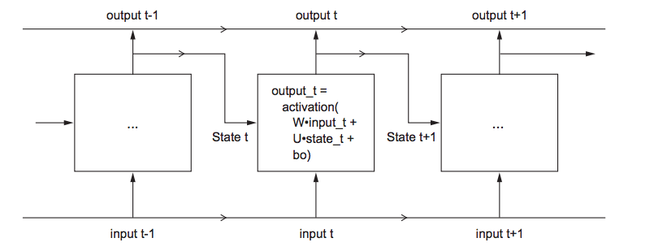
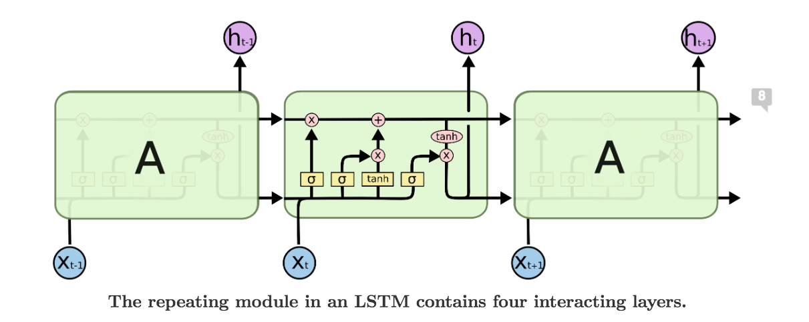
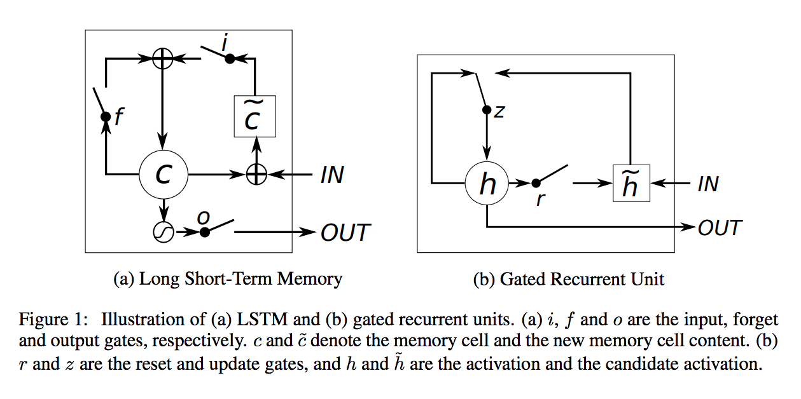

## 1. Simple RNN Structures


* Simple RNN is likely to result in __vanishing gradient problem__: more layers added -> untrainable

## 2. LSTM



* Add an additonal data flow that carries infromation across time (carry) $C_t$
* Update carry 
 1. Decide to forget or remember carr from $t_1$
$$C_{t-1} * \sigma_f([state_t,input_t])$$
 2. Decinde to include or not new information
$$\sigma_i([state_t,input_t]) * \sigma_k([state_t,input_t])$$
 3. Update
$$C_t = C_{t-1} * \sigma_f([state_t,input_t]) + \sigma_i([state_t,input_t]) * \sigma_k([state_t,input_t])$$


## 3. GRU


It combines the forget and input gates into a single “update gate.”

## 4. Pratical notes

* Recurrent dropout to deal with overfitting
```{r,eval = F}
model.add(layers.GRU(32,
dropout=0.2,
recurrent_dropout=0.2,
input_shape=(None, float_data.shape[-1])))
```

* Stacking recurrent layers
all intermediate layers shouild return their full sequence `return_sequences=True`
```{r,eval=FALSE}
model = Sequential()

model.add(layers.GRU(32, dropout=0.1, recurrent_dropout=0.5, return_sequences=True, input_shape=(None, float_data.shape[-1])))

model.add(layers.GRU(64, activation='relu',dropout=0.1,recurrent_dropout=0.5))

model.add(layers.Dense(1))
```